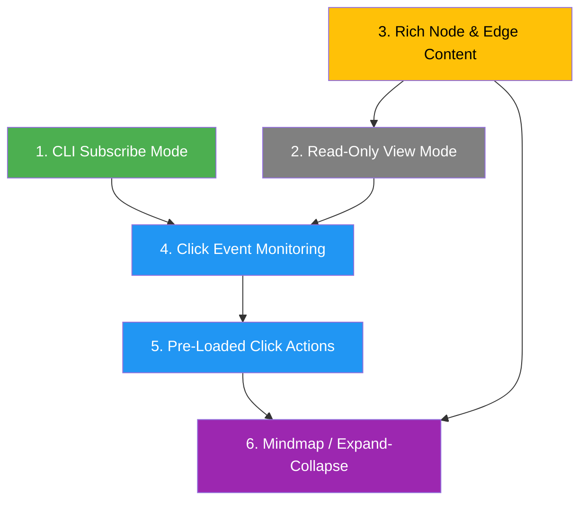

# Future Work

Planned features and exploration areas, ordered by dependency chain.



Legend: green = foundational, yellow = exploration, blue = interactive, purple = advanced

---

## 0. SVG Vector Screenshot Export

**Priority:** Medium (exploration) | **Dependencies:** Screenshot endpoint (once implemented)

vis-network renders to `<canvas>`, which is raster-only. SVG export requires a different approach:

### Options to investigate

* **vis-network `network.canvas.frame.canvas` to SVG:** No native support. Would need to reconstruct the graph as SVG from node/edge position data returned by `getPositions()` + `getBoundingBox()`. Essentially a server-side SVG renderer using introspection data.
* **`canvas2svg` library:** Drop-in replacement for CanvasRenderingContext2D that records to SVG. Would require hooking into vis-network's render pipeline — fragile, may break on updates.
* **D3.js parallel renderer:** Maintain a second SVG-based renderer alongside vis-network. High effort, but native vector output.
* **Graphviz DOT export + render:** Export graph as DOT, render with Graphviz to SVG server-side. Layout won't match browser positions but produces clean vector output.

### Recommended approach

Hybrid: use `getPositions()` to get exact node coordinates from vis-network, then generate SVG server-side using those positions. This preserves the interactive layout while producing clean vector output. Could be a new `format=svg` parameter on `/api/screenshot`.

---

## 1. CLI Subscribe Mode ✅ COMPLETED

**Status:** Implemented — server SSE endpoint + CLI `--subscribe`.

Delivered via a **Server-Sent-Events** transport rather than `/ws`: a stdlib
WebSocket client is impractical, and letting non-browser subscribers onto `/ws`
would break the server's browser-command assumptions. Instead:

* Server: `GET /api/events` (`text/event-stream`) fans every broadcast event
  (plus browser `action`/`ext:` relays) to each subscriber as `data: {...}`,
  with a `: ping` heartbeat every ~15s and a bounded per-subscriber queue that
  drops slow consumers (no memory leak). `/ws` is untouched.
* CLI: `--subscribe [--format jsonl|human]` streams `/api/events` via
  `urllib`, one line per event; Ctrl-C exits 0; implies no REPL.

```bash
./graph-vis-cli.py --subscribe                 # human-readable
./graph-vis-cli.py --subscribe --format jsonl  # raw JSON per line
```

Tests: `tests/test_sse.py` (server stream) + subscribe/format cases in
`tests/test_cli.py`.

<details><summary>Original plan (for reference)</summary>

Add a CLI mode to subscribe to real-time graph mutation events. The CLI would print events as they arrive (JSON or human-readable).

```bash
# Stream updates as they happen
./graph-vis-cli.py --subscribe

# With formatting
./graph-vis-cli.py --subscribe --format jsonl
./graph-vis-cli.py --subscribe --format human
```

Use cases:

* Monitor browser-driven graph edits from terminal
* Pipe updates to external tools (`jq`, logging, etc.)
* Foundation for CLI-driven reactive workflows (sections 4-6)

Related: `graph/g` command already does a one-shot graph dump via `GET /api/graph`. The subscribe mode adds continuous streaming.

</details>

---

## 2. Read-Only View Mode ✅ COMPLETED

**Status:** Implemented in v0.5.0

Implemented as `--read-only` server flag + `GRAPH_VIS_READ_ONLY` env var:

* All mutation endpoints return 403 in read-only mode
* `GET /api/read-only` endpoint for frontend to check state
* Browser `/clear` command blocked, `/help` shows read-only notice
* Node dragging, zoom, pan still work
* Hook actions (toggle_node, etc.) still work locally for exploration

---

## 3. Rich Node & Edge Content

**Priority:** Low (exploration) | **Dependencies:** None, but informs sections 5-6

Explore vis-network's capabilities for rich content inside and around nodes:

### Questions to investigate

* **Images in nodes:** vis-network supports `shape: "image"` and `shape: "circularImage"` — can we set per-node images via API?
* **HTML in nodes:** vis-network doesn't natively render HTML inside nodes, but `title` property shows HTML tooltips on hover. Could use custom SVG or foreignObject for inline HTML.
* **Hyperlinks:** Nodes/edges can't be native `<a>` tags, but click handlers can open URLs. Could store URL in node/edge data and open on click (or Ctrl+click).
* **Small tables in nodes:** Would require SVG foreignObject or a custom renderer. Alternatively, show tables in a side panel on node selection.
* **Edge labels as hyperlinks:** Same approach — store URL, open on click.

### Design considerations

* How does the REST API schema change? Add optional `image`, `url`, `html` fields to nodes?
* How does the intermediate converter format extend to carry rich metadata?
* Performance impact of complex node rendering at scale?

---

## 4. Click Event Monitoring

**Priority:** Medium | **Dependencies:** Section 1 (subscribe mode) + Section 2 (read-only view)

In read-only mode, broadcast click events to subscribers so external tools can react to user interactions.

New WebSocket events:

```json
{"event": "click-node", "data": {"id": "Alice", "label": "Alice"}}
{"event": "click-edge", "data": {"id": "Alice-knows-Bob", "label": "knows"}}
{"event": "click-background", "data": {"x": 150, "y": 200}}
```

CLI usage:

```bash
# Monitor clicks
./graph-vis-cli.py --subscribe --events clicks

# React to clicks in a script
./graph-vis-cli.py --subscribe --format jsonl | while read event; do
    # process click events
done
```

This turns the graph visualization into an interactive UI where the browser is the display and the CLI/scripts are the controller.

**Depends on:**

* Section 1 — subscribe mode provides the delivery mechanism
* Section 2 — read-only mode ensures clicks are intentional actions, not accidental edit triggers

---

## 5. Pre-Loaded Click Actions

**Priority:** Medium | **Dependencies:** Section 4 (click monitoring)

Allow pre-registering actions that execute immediately when a user clicks a node, without round-trip to an external subscriber. This enables instant visual feedback.

Concept: attach an "on-click payload" to nodes via API:

```json
POST /api/set-click-action
{
    "node_id": "Databases",
    "action": "expand",
    "payload": {
        "add_triplets": [
            {"subject": "Databases", "predicate": "includes", "object": "PostgreSQL"},
            {"subject": "Databases", "predicate": "includes", "object": "Redis"},
            {"subject": "Databases", "predicate": "includes", "object": "MongoDB"}
        ],
        "remove_nodes": []
    }
}
```

When the user clicks "Databases", the browser executes the pre-loaded mutations instantly (no network round-trip to an external controller), then broadcasts to subscribers.

Design questions:

* Toggle behavior: click once to expand, click again to collapse?
* Visual indicator that a node has a click action attached (e.g., bold border, icon)?
* Can actions chain? (clicking an expanded child triggers further expansion)

**Depends on:**

* Section 4 — click events as the trigger mechanism

---

## 6. Mindmap / Expand-Collapse Trees

**Priority:** Low (advanced) | **Dependencies:** Section 5 (pre-loaded click actions), Section 3 (rich content helps)

Combine pre-loaded click actions with tree-like graph structures to implement mindmap behavior:

* **Expand:** Click a node to reveal its children (hidden sub-graph becomes visible)
* **Collapse:** Click again to hide children
* **Lazy loading:** Children loaded on-demand from server or pre-loaded in batches
* **Layout hints:** Suggest hierarchical layout for expanded subtrees

This effectively turns the graph visualizer into an interactive mindmap / knowledge explorer where:

1. CLI pre-loads the full graph structure with expand/collapse actions
2. Browser shows only the top-level nodes initially
3. User explores by clicking to expand
4. Each expansion/collapse is broadcast to subscribers

```bash
# Load a large knowledge graph but only show root nodes
./graph-vis-cli.py -l knowledge-base.csv --mindmap-root "Computer Science"
```

**Depends on:**

* Section 5 — pre-loaded click actions for expand/collapse
* Section 3 — rich content makes mindmap nodes more useful (images, links, summaries)
