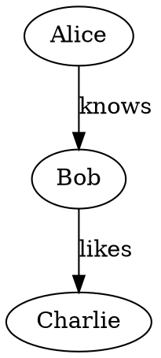

# graph-rest-cli.py Implementation Plan

> **For Claude:** REQUIRED SUB-SKILL: Use superpowers:executing-plans to implement this plan task-by-task.

**Goal:** Build a stdlib-only REPL CLI (`graph-rest-cli.py`) that connects to the graph-vis server via REST, plus 4 format converter scripts for the Load command.

**Architecture:** Main CLI uses only stdlib (`urllib.request`, `json`, `argparse`, `cmd`). Converters are standalone `uv run` scripts under `scripts/converters/`, each with ACM ICPC style problem dirs. CLI's `L` command shells out to converters and parses intermediate format output.

**Tech Stack:** Python 3.11+ stdlib, rdflib (ttl2graph only), uv for converter shebangs.

---

### Task 1: graph-rest-cli.py — Core REPL with HTTP client

**Files:**

* Create: `graph-rest-cli.py`
* Create: `tests/test_cli.py`

**Step 1: Create `graph-rest-cli.py` with HTTP client and REPL**

The entire CLI in one file. Uses `cmd.Cmd` for the REPL loop, `urllib.request` for HTTP, `argparse` for CLI flags.

```python
#!/usr/bin/env python3
"""graph-rest-cli — Interactive REPL for the graph visualization server.

Connects to a graph-vis server via REST API and provides an interactive
command-line interface for graph manipulation. All mutations are sent to
the server; the server broadcasts changes to all connected WebSocket clients.

Usage
-----
    ./graph-rest-cli.py                        # default 127.0.0.1:7849
    ./graph-rest-cli.py --port 9999            # custom port
    ./graph-rest-cli.py --host 10.0.0.5 -vv   # custom host, debug verbosity

Commands
--------
    add / a          <subj> <pred> <obj>   Add triplet (default for 3 bare words)
    add-node / an    <id>                  Add single node
    add-edge / ae    <from> <pred> <to>    Add edge
    del / d / rm     <id>                  Delete node (cascade edges)
    del-edge / de    <edge-id>             Delete edge
    list / ls / l    [nodes|edges]         List graph contents
    graph / g                              Full graph summary
    Load / L         <filepath>            Load graph from file
    help / ? / h                           Show command reference
    quit / exit / q                        Exit REPL
"""

import argparse
import cmd
import json
import os
import subprocess
import sys
import time
import urllib.request
import urllib.error


class GraphClient:
    """HTTP client for the graph-vis REST API using only stdlib."""

    def __init__(self, host, port, verbosity=0):
        self.base_url = f"http://{host}:{port}"
        self.verbosity = verbosity

    def _request(self, method, path, data=None):
        url = f"{self.base_url}{path}"
        body = json.dumps(data).encode() if data else None
        req = urllib.request.Request(url, data=body, method=method)
        if body:
            req.add_header("Content-Type", "application/json")

        t0 = time.time()
        if self.verbosity >= 1:
            print(f"  -> {method} {url}", file=sys.stderr)
        if self.verbosity >= 3 and body:
            print(f"  -> body: {body.decode()}", file=sys.stderr)

        try:
            with urllib.request.urlopen(req) as resp:
                elapsed = time.time() - t0
                resp_body = resp.read().decode()
                if self.verbosity >= 1:
                    print(f"  <- {resp.status} ({elapsed:.3f}s)", file=sys.stderr)
                if self.verbosity >= 2:
                    print(f"  <- headers: {dict(resp.headers)}", file=sys.stderr)
                if self.verbosity >= 3:
                    print(f"  <- body: {resp_body}", file=sys.stderr)
                return json.loads(resp_body)
        except urllib.error.URLError as e:
            print(f"Error: {e}", file=sys.stderr)
            return None

    def get_graph(self):
        return self._request("GET", "/api/graph")

    def add_node(self, node_id, label=None):
        return self._request("POST", "/api/add-node",
                             {"id": node_id, "label": label or node_id})

    def remove_node(self, node_id):
        return self._request("POST", "/api/remove-node", {"id": node_id})

    def add_edge(self, frm, to, label):
        return self._request("POST", "/api/add-edge",
                             {"from": frm, "to": to, "label": label})

    def remove_edge(self, edge_id):
        return self._request("POST", "/api/remove-edge", {"id": edge_id})

    def add_triplet(self, subject, predicate, obj):
        return self._request("POST", "/api/add-triplet",
                             {"subject": subject, "predicate": predicate,
                              "object": obj})


# Converter extension mapping
CONVERTER_MAP = {
    ".csv": "csv2graph",
    ".ttl": "ttl2graph",
    ".n3": "ttl2graph",
    ".dot": "dot2graph",
    ".gv": "dot2graph",
    ".mermaid": "mermaid2graph",
    ".mmd": "mermaid2graph",
}


class GraphREPL(cmd.Cmd):
    """Interactive REPL for graph-vis server."""

    def __init__(self, client):
        super().__init__()
        self.client = client
        self.prompt = f"graph@{client.base_url.split('//')[1]}> "

    def preloop(self):
        graph = self.client.get_graph()
        if graph:
            nn, ne = len(graph["nodes"]), len(graph["edges"])
            print(f"Connected to {self.client.base_url} ({nn} nodes, {ne} edges)")
        else:
            print(f"Warning: Could not connect to {self.client.base_url}")
        print("Type 'help' or '?' for commands.")

    # -- Commands ----------------------------------------------------------

    def do_add(self, arg):
        """add <subject> <predicate> <object> — Add a triplet (shortcut: a)"""
        parts = arg.split()
        if len(parts) != 3:
            print("Usage: add <subject> <predicate> <object>")
            return
        r = self.client.add_triplet(*parts)
        if r and r.get("ok"):
            print(f"Added: {parts[0]} —{parts[1]}→ {parts[2]}")

    do_a = do_add

    def do_add_node(self, arg):
        """add-node <id> — Add a single node (shortcut: an)"""
        node_id = arg.strip()
        if not node_id:
            print("Usage: add-node <id>")
            return
        r = self.client.add_node(node_id)
        if r and r.get("ok"):
            print(f"Added node: {node_id}")

    do_an = do_add_node

    def do_add_edge(self, arg):
        """add-edge <from> <predicate> <to> — Add an edge (shortcut: ae)"""
        parts = arg.split()
        if len(parts) != 3:
            print("Usage: add-edge <from> <predicate> <to>")
            return
        r = self.client.add_edge(parts[0], parts[2], parts[1])
        if r and r.get("ok"):
            print(f"Added edge: {parts[0]} —{parts[1]}→ {parts[2]}")

    do_ae = do_add_edge

    def do_del(self, arg):
        """del <id> — Delete a node and its edges (shortcuts: d, rm, delete)"""
        node_id = arg.strip()
        if not node_id:
            print("Usage: del <id>")
            return
        r = self.client.remove_node(node_id)
        if r and r.get("ok"):
            removed = r.get("removed_edges", [])
            print(f"Deleted node: {node_id} (removed {len(removed)} edge(s))")

    do_d = do_del
    do_rm = do_del
    do_delete = do_del

    def do_del_edge(self, arg):
        """del-edge <edge-id> — Delete an edge (shortcut: de)"""
        edge_id = arg.strip()
        if not edge_id:
            print("Usage: del-edge <edge-id>")
            return
        r = self.client.remove_edge(edge_id)
        if r and r.get("ok"):
            removed = "removed" if r.get("removed") else "not found"
            print(f"Edge {edge_id}: {removed}")

    do_de = do_del_edge

    def do_list(self, arg):
        """list [nodes|edges] — List graph contents (shortcuts: ls, l)"""
        graph = self.client.get_graph()
        if not graph:
            return
        what = arg.strip().lower()
        if what in ("", "all"):
            self._print_nodes(graph["nodes"])
            self._print_edges(graph["edges"])
        elif what in ("nodes", "n"):
            self._print_nodes(graph["nodes"])
        elif what in ("edges", "e"):
            self._print_edges(graph["edges"])
        else:
            print("Usage: list [nodes|edges]")

    do_ls = do_list
    do_l = do_list

    def _print_nodes(self, nodes):
        print(f"Nodes ({len(nodes)}):")
        for n in nodes:
            print(f"  {n['id']}")

    def _print_edges(self, edges):
        print(f"Edges ({len(edges)}):")
        for e in edges:
            print(f"  {e['id']}: {e['from']} —{e['label']}→ {e['to']}")

    def do_graph(self, arg):
        """graph — Show full graph summary (shortcut: g)"""
        graph = self.client.get_graph()
        if not graph:
            return
        nn, ne = len(graph["nodes"]), len(graph["edges"])
        print(f"Graph: {nn} nodes, {ne} edges")
        if nn > 0:
            self._print_nodes(graph["nodes"])
        if ne > 0:
            self._print_edges(graph["edges"])

    do_g = do_graph

    def do_Load(self, arg):
        """Load <filepath> — Load graph from file (shortcut: L)"""
        filepath = arg.strip()
        if not filepath:
            print("Usage: Load <filepath>")
            return
        if not os.path.isfile(filepath):
            print(f"File not found: {filepath}")
            return
        _, ext = os.path.splitext(filepath)
        ext = ext.lower()
        converter_name = CONVERTER_MAP.get(ext)
        if not converter_name:
            print(f"Unsupported format: {ext}")
            print(f"Supported: {', '.join(sorted(set(CONVERTER_MAP.values())))}")
            return
        # Find converter script
        script_dir = os.path.join(
            os.path.dirname(os.path.abspath(__file__)),
            "scripts", "converters", converter_name,
            f"{converter_name}.py",
        )
        if not os.path.isfile(script_dir):
            print(f"Converter not found: {script_dir}")
            return
        try:
            result = subprocess.run(
                [sys.executable, script_dir, filepath],
                capture_output=True, text=True, timeout=30,
            )
            if result.returncode != 0:
                print(f"Converter error: {result.stderr}")
                return
            self._load_intermediate(result.stdout, filepath, ext)
        except subprocess.TimeoutExpired:
            print("Converter timed out (30s)")

    do_L = do_Load

    def _load_intermediate(self, text, filepath, ext):
        """Parse intermediate format and send triplets to server."""
        lines = text.strip().split("\n")
        if len(lines) < 1:
            print("Empty converter output")
            return
        header = lines[0].split()
        if len(header) != 2:
            print(f"Invalid header: {lines[0]}")
            return
        vn, en = int(header[0]), int(header[1])
        loaded_edges = 0
        loaded_nodes = set()
        for line in lines[1:]:
            parts = line.split(None, 2)
            if len(parts) == 3:
                frm, to, label = parts
                self.client.add_triplet(frm, label, to)
                loaded_nodes.update([frm, to])
                loaded_edges += 1
        fmt_name = ext.lstrip(".")
        print(f"Loaded {loaded_edges} edges, {len(loaded_nodes)} nodes "
              f"from {filepath} ({fmt_name})")

    def do_quit(self, arg):
        """quit — Exit the REPL (shortcuts: exit, q)"""
        print("Bye.")
        return True

    do_exit = do_quit
    do_q = do_quit
    do_EOF = do_quit  # Ctrl+D

    def do_help(self, arg):
        """help — Show command reference (shortcuts: ?, h)"""
        if arg:
            super().do_help(arg)
            return
        print("""Commands:
  add / a          <subj> <pred> <obj>   Add triplet
  add-node / an    <id>                  Add single node
  add-edge / ae    <from> <pred> <to>    Add edge
  del / d / rm     <id>                  Delete node (cascade)
  del-edge / de    <edge-id>             Delete edge
  list / ls / l    [nodes|edges]         List graph contents
  graph / g                              Full graph summary
  Load / L         <filepath>            Load from file
  help / ? / h                           Show this help
  quit / exit / q                        Exit

Shorthand: 3 bare words = add triplet (e.g. "Alice knows Bob")
Formats for Load: .csv .ttl .n3 .dot .gv .mermaid .mmd""")

    do_h = do_help

    def default(self, line):
        """Handle unrecognized commands — 3 bare words become add triplet."""
        parts = line.split()
        if len(parts) == 3:
            self.do_add(line)
        else:
            print(f"Unknown command: {line.split()[0] if parts else ''}")
            print("Type 'help' for commands.")

    def emptyline(self):
        pass  # Don't repeat last command


def parse_args():
    parser = argparse.ArgumentParser(
        description="Interactive REPL for the graph visualization server.",
        formatter_class=argparse.RawDescriptionHelpFormatter,
        epilog="""Examples:
  %(prog)s                          Connect to 127.0.0.1:7849
  %(prog)s --port 9999              Custom port
  %(prog)s --host 10.0.0.5 -vv     Custom host with debug output""",
    )
    parser.add_argument("--host", default="127.0.0.1",
                        help="Server IP (default: 127.0.0.1)")
    parser.add_argument("--port", type=int, default=7849,
                        help="Server port (default: 7849)")
    parser.add_argument("-v", "--verbose", action="count", default=0,
                        help="Increase verbosity (-v, -vv, -vvv)")
    return parser.parse_args()


def main():
    args = parse_args()
    client = GraphClient(args.host, args.port, args.verbose)
    repl = GraphREPL(client)
    try:
        repl.cmdloop()
    except KeyboardInterrupt:
        print("\nBye.")


if __name__ == "__main__":
    main()
```

**Step 2: Make executable**

Run: `chmod +x graph-rest-cli.py`

**Step 3: Write tests for GraphClient and REPL**

Create `tests/test_cli.py`:

```python
"""Tests for graph-rest-cli GraphClient and REPL parsing."""

import io
import json
from unittest.mock import patch, MagicMock
from graph_rest_cli import GraphClient, GraphREPL, parse_args


def test_parse_args_defaults():
    with patch("sys.argv", ["prog"]):
        args = parse_args()
        assert args.host == "127.0.0.1"
        assert args.port == 7849
        assert args.verbose == 0


def test_parse_args_custom():
    with patch("sys.argv", ["prog", "--host", "10.0.0.1", "--port", "9999", "-vvv"]):
        args = parse_args()
        assert args.host == "10.0.0.1"
        assert args.port == 9999
        assert args.verbose == 3


def test_client_base_url():
    c = GraphClient("10.0.0.5", 8080)
    assert c.base_url == "http://10.0.0.5:8080"


def test_repl_prompt():
    c = GraphClient("127.0.0.1", 7849)
    repl = GraphREPL(c)
    assert repl.prompt == "graph@127.0.0.1:7849> "


def test_repl_default_three_words(capsys):
    """3 bare words should be treated as add triplet."""
    c = GraphClient("127.0.0.1", 7849)
    repl = GraphREPL(c)
    with patch.object(c, "add_triplet", return_value={"ok": True}):
        repl.default("Alice knows Bob")
        c.add_triplet.assert_called_once_with("Alice", "knows", "Bob")


def test_repl_default_unknown_command(capsys):
    """Non-3-word input should print unknown command."""
    c = GraphClient("127.0.0.1", 7849)
    repl = GraphREPL(c)
    repl.default("badcommand")
    out = capsys.readouterr().out
    assert "Unknown command" in out
```

Note: the module import requires the filename to use underscores, so we import as `graph_rest_cli`. The file on disk is `graph-rest-cli.py` but Python can import it with a trick. To keep tests simple, add a symlink in Step 4.

**Step 4: Add importable symlink for tests**

Run:
```bash
ln -sf graph-rest-cli.py graph_rest_cli.py
echo "graph_rest_cli.py" >> .gitignore
```

**Step 5: Run tests**

Run: `pytest tests/test_cli.py -v -p no:playwright`
Expected: All 5 tests PASS

**Step 6: Commit**

```bash
git add graph-rest-cli.py tests/test_cli.py .gitignore
git commit -m "feat: Add graph-rest-cli.py REPL with HTTP client and tests

* stdlib-only: urllib.request, json, cmd, argparse
* Shell-like prompt: graph@host:port>
* All commands with shortcuts: add/a, del/d/rm, list/ls/l, graph/g, etc.
* 3 bare words default to add triplet
* Verbosity levels: -v/-vv/-vvv
* Load command (L) shells out to converter scripts
* Tests for arg parsing, client, REPL prompt, default command"
```

---

### Task 2: csv2graph converter

**Files:**

* Create: `scripts/converters/csv2graph/csv2graph.py`
* Create: `scripts/converters/csv2graph/PROBLEM.md`
* Create: `scripts/converters/csv2graph/input/sample.csv`
* Create: `scripts/converters/csv2graph/output/sample.txt`
* Create: `scripts/converters/csv2graph/output/sample.csv`
* Create: `scripts/converters/csv2graph/output/sample.jsonl`

**Step 1: Create PROBLEM.md**

```markdown
# csv2graph

## Problem Statement

Given a CSV file where the first three columns represent source, target, and
edge label (header row names are ignored), convert it to the graph intermediate
format.

## Input Format

A CSV file with a header row and data rows. Only the first three columns are
used (remaining columns are ignored). The first row is always treated as a
header and skipped.

### Example Input (`sample.csv`)

    source,target,relationship
    Alice,Bob,knows
    Bob,Charlie,likes
    Charlie,Alice,helps

## Output Format

### Plain text (default)

First line: `Vn En` (vertex count, edge count).
Subsequent lines: `from to label` (one edge per line).

    3 3
    Alice Bob knows
    Bob Charlie likes
    Charlie Alice helps

### CSV (`--csv`)

    from,to,label
    Alice,Bob,knows
    Bob,Charlie,likes
    Charlie,Alice,helps

### JSONL (`--jsonl`)

    {"from": "Alice", "to": "Bob", "label": "knows"}
    {"from": "Bob", "to": "Charlie", "label": "likes"}
    {"from": "Charlie", "to": "Alice", "label": "helps"}
```

**Step 2: Create input/output test files**

`input/sample.csv`:
```
source,target,relationship
Alice,Bob,knows
Bob,Charlie,likes
Charlie,Alice,helps
```

`output/sample.txt`:
```
3 3
Alice Bob knows
Bob Charlie likes
Charlie Alice helps
```

`output/sample.csv`:
```
from,to,label
Alice,Bob,knows
Bob,Charlie,likes
Charlie,Alice,helps
```

`output/sample.jsonl`:
```
{"from": "Alice", "to": "Bob", "label": "knows"}
{"from": "Bob", "to": "Charlie", "label": "likes"}
{"from": "Charlie", "to": "Alice", "label": "helps"}
```

**Step 3: Create csv2graph.py**

See the converter template in the design doc. Uses stdlib `csv` module. The `convert()` function reads CSV, skips header, extracts first 3 columns. `format_output()` handles plain/csv/jsonl. `main()` uses argparse.

**Step 4: Verify**

Run:
```bash
chmod +x scripts/converters/csv2graph/csv2graph.py
./scripts/converters/csv2graph/csv2graph.py scripts/converters/csv2graph/input/sample.csv
diff <(./scripts/converters/csv2graph/csv2graph.py scripts/converters/csv2graph/input/sample.csv) scripts/converters/csv2graph/output/sample.txt
diff <(./scripts/converters/csv2graph/csv2graph.py scripts/converters/csv2graph/input/sample.csv --csv) scripts/converters/csv2graph/output/sample.csv
diff <(./scripts/converters/csv2graph/csv2graph.py scripts/converters/csv2graph/input/sample.csv --jsonl) scripts/converters/csv2graph/output/sample.jsonl
```

Expected: all diffs empty (exact match).

**Step 5: Commit**

```bash
git add scripts/converters/csv2graph/
git commit -m "feat: Add csv2graph converter with ACM ICPC problem structure

* Reads CSV, skips header, uses first 3 columns as from/to/label
* Outputs: plain text (default), --csv, --jsonl
* Dual-use: standalone executable + importable library
* PROBLEM.md + input/output test fixtures"
```

---

### Task 3: ttl2graph converter

**Files:**

* Create: `scripts/converters/ttl2graph/ttl2graph.py`
* Create: `scripts/converters/ttl2graph/PROBLEM.md`
* Create: `scripts/converters/ttl2graph/input/sample.ttl`
* Create: `scripts/converters/ttl2graph/output/sample.txt`
* Create: `scripts/converters/ttl2graph/output/sample.csv`
* Create: `scripts/converters/ttl2graph/output/sample.jsonl`

Same structure as csv2graph. Uses `rdflib` dependency (declared in PEP 723 metadata). Parses RDF triples, extracts local name from URIs (e.g., `http://example.org/Alice` → `Alice`). Supports `.ttl` and `.n3`.

**Sample input (`sample.ttl`):**
```turtle
@prefix ex: <http://example.org/> .
ex:Alice ex:knows ex:Bob .
ex:Bob ex:likes ex:Charlie .
```

**Step: Create, verify with diff against expected output, commit.**

---

### Task 4: dot2graph converter

**Files:**

* Create: `scripts/converters/dot2graph/dot2graph.py`
* Create: `scripts/converters/dot2graph/PROBLEM.md`
* Create: `scripts/converters/dot2graph/input/sample.dot`
* Create: `scripts/converters/dot2graph/output/sample.txt`
* Create: `scripts/converters/dot2graph/output/sample.csv`
* Create: `scripts/converters/dot2graph/output/sample.jsonl`

Stdlib-only regex parser. Parses `digraph { A -> B [label="knows"]; }` syntax. Extracts node names and edge labels. Handles quoted and unquoted labels, `->` and `--` edges.

**Sample input (`sample.dot`):**


**Step: Create, verify with diff, commit.**

---

### Task 5: mermaid2graph converter

**Files:**

* Create: `scripts/converters/mermaid2graph/mermaid2graph.py`
* Create: `scripts/converters/mermaid2graph/PROBLEM.md`
* Create: `scripts/converters/mermaid2graph/input/sample.mermaid`
* Create: `scripts/converters/mermaid2graph/output/sample.txt`
* Create: `scripts/converters/mermaid2graph/output/sample.csv`
* Create: `scripts/converters/mermaid2graph/output/sample.jsonl`

Stdlib-only regex parser. Parses `graph`/`flowchart` blocks. Handles `A -->|label| B` and `A -- label --> B` syntax patterns.

**Sample input (`sample.mermaid`):**


**Step: Create, verify with diff, commit.**

---

### Task 6: Integration — Wire Load command + README

**Files:**

* Modify: `graph-rest-cli.py` (if any adjustments needed after converter testing)
* Create: `graph-rest-cli.README.md`

**Step 1: End-to-end test of Load command**

Start server, then test:
```bash
./server.py &
sleep 1
echo "L scripts/converters/csv2graph/input/sample.csv" | ./graph-rest-cli.py
echo "g" | ./graph-rest-cli.py
```

Expected: nodes and edges loaded from CSV appear in graph.

**Step 2: Create `graph-rest-cli.README.md`**

Usage, all commands with examples, Load format support, verbosity levels, converter architecture overview.

**Step 3: Commit**

```bash
git add graph-rest-cli.README.md
git commit -m "docs: Add graph-rest-cli README with usage and command reference"
```

---

## Parallelization Notes

Tasks 2-5 (converters) are fully independent and can be dispatched as parallel sub-agents. Task 1 (CLI) is independent of converters. Task 6 (integration) depends on all prior tasks.
