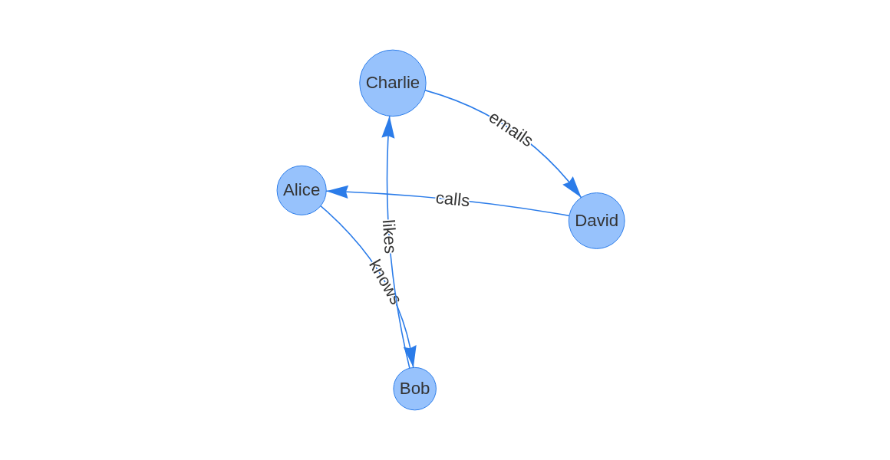
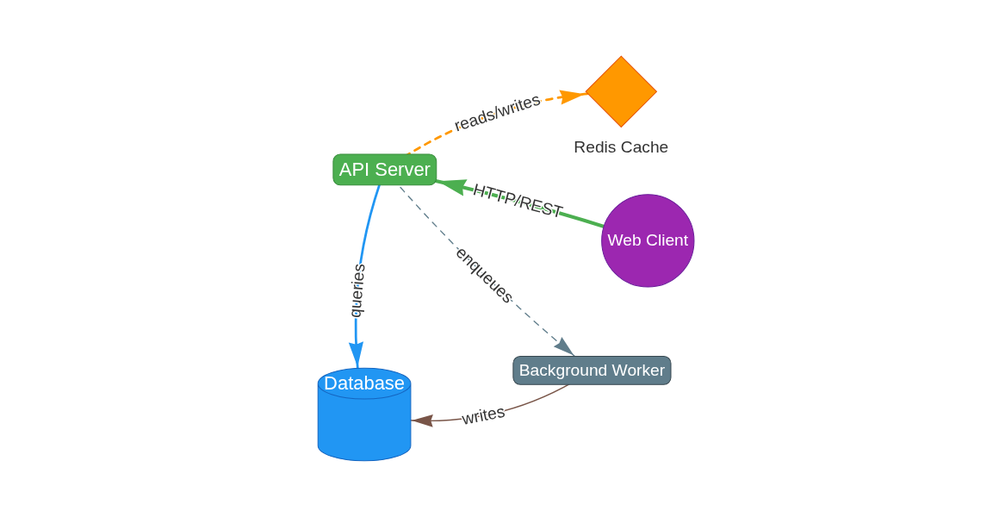
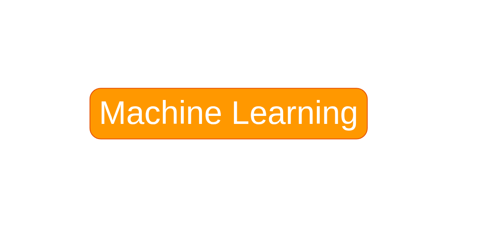
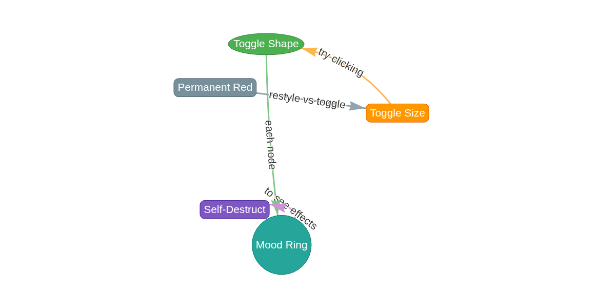
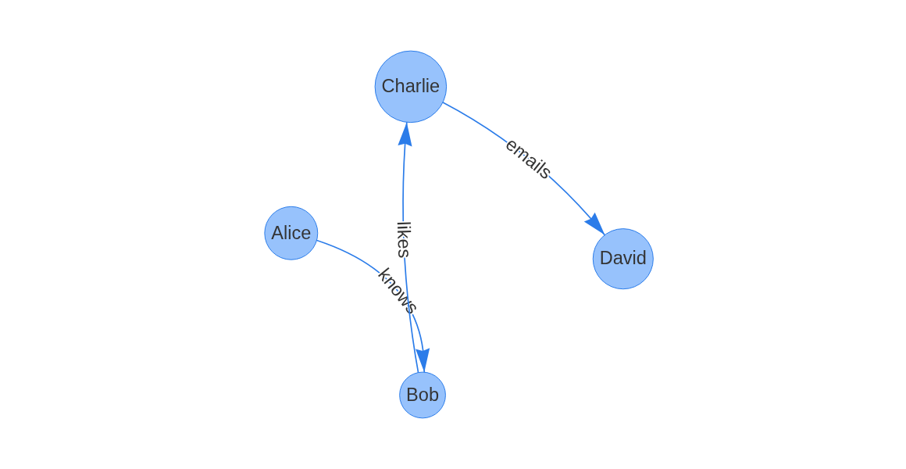
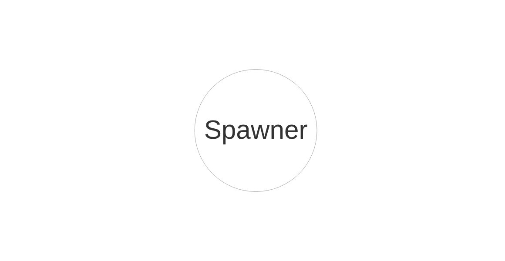
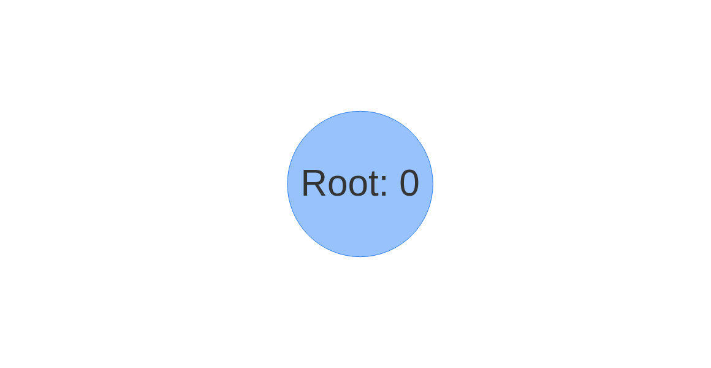
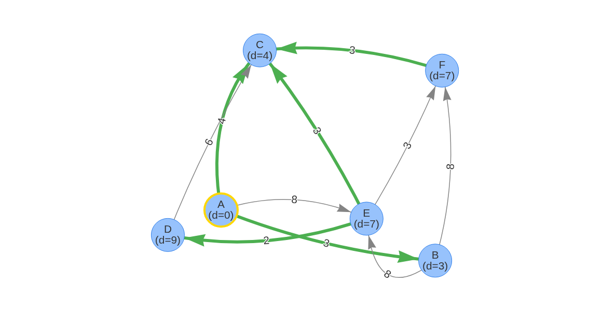

# Graph Visualization: Illustrated Tutorial

This guide shows how to build, style, and interact with graphs using the graph-vis server, CLI, and extension system. Each section includes the commands to run and a screenshot of the result.

## Prerequisites

Start the server:

```bash
./graph-vis-server.py
```

Open the browser at `http://localhost:7849`. All CLI commands below connect to this server.

---

## 1. Basic Graph: Adding Triplets

The simplest way to create a graph is with subject-predicate-object triplets. Each triplet creates two nodes and a labeled edge.

**CLI command:**

```bash
echo "Alice knows Bob
Bob likes Charlie
Charlie emails David
David calls Alice" | ./graph-vis-cli.py
```

Or as positional arguments:

```bash
./graph-vis-cli.py "Alice knows Bob" "Bob likes Charlie" "Charlie emails David" "David calls Alice"
```

**Result:**



Four nodes connected in a cycle with labeled edges. The physics engine positions them automatically.

---

## 2. Styled Graph with JSONL

JSONL format gives full control over node shapes, colors, fonts, and edge styling. Each line is a JSON object with a `type` field (`node`, `edge`, or `triplet`).

**Input file** (`examples/styled-graph.jsonl`):

```jsonl
{"type":"node","id":"Server","label":"API Server","color":{"background":"#4CAF50","border":"#388E3C"},"shape":"box","font":{"color":"white","size":16}}
{"type":"node","id":"DB","label":"Database","color":{"background":"#2196F3","border":"#1565C0"},"shape":"database","font":{"color":"white","size":16}}
{"type":"node","id":"Cache","label":"Redis Cache","color":{"background":"#FF9800","border":"#E65100"},"shape":"diamond","font":{"size":14}}
{"type":"node","id":"Client","label":"Web Client","color":{"background":"#9C27B0","border":"#6A1B9A"},"shape":"circle","font":{"color":"white","size":14}}
{"type":"node","id":"Worker","label":"Background Worker","color":{"background":"#607D8B","border":"#37474F"},"shape":"box","font":{"color":"white","size":14}}
{"type":"edge","from":"Client","to":"Server","label":"HTTP/REST","color":{"color":"#4CAF50"},"width":3}
{"type":"edge","from":"Server","to":"DB","label":"queries","color":{"color":"#2196F3"},"width":2}
{"type":"edge","from":"Server","to":"Cache","label":"reads/writes","color":{"color":"#FF9800"},"width":2,"dashes":true}
{"type":"edge","from":"Server","to":"Worker","label":"enqueues","color":{"color":"#607D8B"},"width":1,"dashes":[5,5]}
{"type":"edge","from":"Worker","to":"DB","label":"writes","color":{"color":"#795548"},"width":1}
```

**CLI command:**

```bash
./graph-vis-cli.py -l examples/styled-graph.jsonl
```

**Result:**



Each node has a distinct shape (box, database, diamond, circle) and color scheme. Edges show different widths and dash patterns. All vis-network styling properties are supported as pass-through extras.

### Available node shapes

* Label inside: `ellipse`, `circle`, `database`, `box`, `text`
* Label outside: `image`, `circularImage`, `diamond`, `dot`, `star`, `triangle`, `triangleDown`, `hexagon`, `square`, `icon`

### Common styling properties

| Property | Example | Description |
|----------|---------|-------------|
| `color.background` | `"#4CAF50"` | Node fill color |
| `color.border` | `"#388E3C"` | Node border color |
| `shape` | `"box"` | Node shape |
| `font.color` | `"white"` | Label text color |
| `font.size` | `16` | Label font size |
| `width` | `3` | Edge thickness |
| `dashes` | `true` or `[5,5]` | Dashed edge |
| `hidden` | `true` | Initially invisible |
| `physics` | `false` | Excluded from layout |

---

## 3. Interactive Mind Map with Hooks

Hooks let you define click actions directly in JSONL. Nodes can expand/collapse subtrees, change styles, and more — all without any JavaScript.

**Concept:** Define all nodes upfront (children start `hidden: true, physics: false`), then use `on_click` hooks to toggle their visibility.

**Input file** (`examples/mindmap.jsonl`) — key parts:

```jsonl
# Root: visible, click reveals 3 categories
{"type":"node","id":"ML","label":"Machine Learning",
 "color":{"background":"#FF9800"},"shape":"box",
 "on_click":[
   {"action":"toggle_node","id":"Supervised"},
   {"action":"toggle_node","id":"Unsupervised"},
   {"action":"toggle_node","id":"Reinforcement"},
   {"action":"toggle_style","id":"ML","style":{"borderWidth":4,"color":{"border":"#FFD700"}}}
 ]}

# Children: hidden until parent is clicked
{"type":"node","id":"Supervised","label":"Supervised",
 "hidden":true,"physics":false,
 "color":{"background":"#4CAF50"},"shape":"box",
 "on_click":[
   {"action":"toggle_node","id":"SVM"},
   {"action":"toggle_node","id":"RandomForest"},
   {"action":"toggle_node","id":"NeuralNets"}
 ]}

# Leaf nodes: hidden
{"type":"node","id":"SVM","label":"SVM","hidden":true,"physics":false}

# Edges: also hidden
{"type":"edge","from":"ML","to":"Supervised","hidden":true,"physics":false}
```

**CLI command:**

```bash
./graph-vis-cli.py -l examples/mindmap.jsonl
```

**Result (collapsed):**



Only the root "Machine Learning" node is visible. Clicking it reveals the three category nodes (Supervised, Unsupervised, Reinforcement) and highlights the root with a gold border. Clicking a category reveals its leaf nodes.

### Hook action types

| Action | Fields | What it does |
|--------|--------|-------------|
| `toggle_node` | `id` | Show/hide a node and its edges |
| `toggle_edge` | `id` | Show/hide an edge |
| `restyle` | `id` + properties | Permanently change styling |
| `toggle_style` | `id`, `style` | Toggle between original and new style |
| `add_node` | `id`, `label`, extras | Create a new node |
| `remove_node` | `id` | Delete a node |
| `add_edge` | `from`, `to`, extras | Create a new edge |
| `remove_edge` | `id` | Delete an edge |

---

## 4. Restyle vs Toggle Style

The `restyle` action permanently changes properties. The `toggle_style` action alternates between original and new styling on each click.

**Input file** (`examples/styled-hooks.jsonl`):

```jsonl
# Permanent: turns red on click (irreversible)
{"type":"node","id":"PermanentRed","label":"Permanent Red",
 "color":{"background":"#78909C"},"shape":"box",
 "on_click":[{"action":"restyle","id":"PermanentRed",
   "color":{"background":"#F44336","border":"#B71C1C"}}]}

# Toggle: alternates between normal and large
{"type":"node","id":"ToggleSize","label":"Toggle Size",
 "color":{"background":"#FF9800"},"shape":"box",
 "on_click":[{"action":"toggle_style","id":"ToggleSize",
   "style":{"size":40,"font":{"size":22},"borderWidth":4}}]}

# Toggle: alternates between ellipse and star
{"type":"node","id":"ToggleShape","label":"Toggle Shape",
 "color":{"background":"#4CAF50"},"shape":"ellipse",
 "on_click":[{"action":"toggle_style","id":"ToggleShape",
   "style":{"shape":"star","color":{"background":"#CDDC39"}}}]}
```

**CLI command:**

```bash
./graph-vis-cli.py -l examples/styled-hooks.jsonl
```

**Result:**



Five nodes with different hook behaviors. Click each to see the effect:

* **Permanent Red** — `restyle`: turns red permanently
* **Toggle Size** — `toggle_style`: alternates between normal and large
* **Toggle Shape** — `toggle_style`: alternates between ellipse and star
* **Mood Ring** — `toggle_style`: alternates teal and pink
* **Self-Destruct** — `restyle`: shrinks and fades permanently

---

## 5. JS/CSS Extensions

For complex interactive features beyond what declarative hooks can express, load JavaScript and CSS extensions.

### Loading extensions

```bash
# Via CLI flags
./graph-vis-server.py --ext color-spawner.js --ext color-spawner.css

# Via environment variable
GRAPH_VIS_EXTENSIONS=color-spawner.js,color-spawner.css ./graph-vis-server.py

# Via demo launcher scripts
./examples/demos/color-spawner-demo.sh
```

Extensions access the graph through the `window.graphVis` API:

```javascript
(function(gv) {
    gv.nodes;              // vis.DataSet — add/update/remove nodes
    gv.edges;              // vis.DataSet — add/update/remove edges
    gv.network;            // vis.Network — events, positioning, viewport
    gv.container;          // #graph DOM element
    gv.api;                // REST API helper
    gv.executeAction(act); // Execute a hook action programmatically
    gv.sendEvent(name, data);     // Emit WebSocket event
    gv.onCommand(name, handler);  // Register WS command handler
})(window.graphVis);
```

---

### 5a. Delete on Double-Click Extension

Restores the classic double-click-to-delete behavior as a loadable extension. Yields to hook-defined `on_doubleClick` actions when present.

**Launch:**

```bash
./examples/demos/delete-demo.sh
# or: ./graph-vis-server.py --ext delete-on-doubleclick.js
```

Then add some nodes via CLI:

```bash
./graph-vis-cli.py "Alice knows Bob" "Bob likes Charlie" "Charlie emails David"
```

**Result:**



Double-clicking any node shows a confirmation dialog. If the node has `on_doubleClick` hooks defined, those take priority instead.

---

### 5b. Color Spawner Extension

Interactive demo with HTML overlays. Each node gets a textbox with a hex color and a "New" button. Clicking "New" spawns a child node in that color.

**Launch:**

```bash
./examples/demos/color-spawner-demo.sh
```

**Result:**



The root "Spawner" node appears. In the browser, you'll see an HTML overlay with a color input and "New" button positioned over the node. Click "New" to spawn colored children — each child gets its own overlay with a random color.

> **Note:** HTML overlays are DOM elements positioned over the canvas. The screenshot API captures the canvas only, so overlays appear in the live browser but not in programmatic screenshots.

---

### 5c. Sum Propagation Extension

A tree where each leaf has a number input. Parent nodes display the sum of all their children's values, propagating up to the root.

**Launch:**

```bash
./examples/demos/sum-propagation-demo.sh
```

**Result:**



The root "Root: 0" node appears. In the browser, each node has an overlay with:

* Leaf nodes: editable number input + "+" button to add children
* Parent nodes: computed sum display + "+" button

Changing a leaf's value recomputes all ancestor sums up to the root.

---

### 5d. Shortest Path Extension

Interactive Dijkstra's algorithm visualization. Generates a random weighted graph, computes shortest paths from a source, and highlights the shortest path tree.

**Launch:**

```bash
./examples/demos/shortest-path-demo.sh
```

**Result:**



* **Source node** (A): gold border, distance `d=0`
* **Bold green edges**: shortest path tree
* **Gray edges**: non-shortest-path edges
* **Node labels**: show shortest distance from source (e.g., `B (d=3)`)

**Interactive features (in browser):**

* Click an edge to edit its weight
* **Shift+click** a node to make it the new source
* **"Randomize Weights"** button: assign random weights 1-10
* **"New Random Graph"** button: generate a fresh connected graph

**External control via WebSocket:**

```python
import asyncio, json, websockets

async def set_source():
    async with websockets.connect("ws://localhost:7849/ws") as ws:
        await ws.send(json.dumps({
            "command": "ext:shortest-path:set-source",
            "request_id": "1",
            "params": {"node": "C"}
        }))
        resp = json.loads(await ws.recv())
        print(resp)

asyncio.run(set_source())
```

---

## 6. Taking Screenshots

### Via CLI

```bash
# Save screenshot to file
./graph-vis-cli.py "Alice knows Bob" "ss graph.png"

# With parameters
./graph-vis-cli.py "ss output.png padding=0.2 format=jpeg"
```

### Via REST API

```bash
# Default PNG
curl http://localhost:7849/api/screenshot -o graph.png

# With parameters
curl "http://localhost:7849/api/screenshot?padding=0.2&format=jpeg&quality=0.9&hide_ui=true&background=white" -o graph.jpg

# Custom dimensions
curl "http://localhost:7849/api/screenshot?width=1920&height=1080" -o graph-hd.png
```

### Screenshot parameters

| Parameter | Default | Description |
|-----------|---------|-------------|
| `padding` | `0.1` | Extra space around graph (fraction) |
| `fit` | `true` | Auto-fit to content |
| `format` | `png` | `png` or `jpeg` |
| `quality` | `0.92` | JPEG quality (0-1) |
| `width` | — | Override canvas width (pixels) |
| `height` | — | Override canvas height (pixels) |
| `hide_ui` | `true` | Hide input box and buttons |
| `background` | `white` | Background color |

> **Requirement:** A browser must be connected via WebSocket. The server sends a screenshot command to the browser, which captures its canvas and returns the image.

---

## 7. Building Graphs via REST API

All mutations can be done via HTTP POST:

```bash
# Add a styled node
curl -X POST http://localhost:7849/api/add-node \
  -H "Content-Type: application/json" \
  -d '{"id":"Server","label":"API Server","shape":"box","color":{"background":"#4CAF50"}}'

# Add an edge
curl -X POST http://localhost:7849/api/add-edge \
  -H "Content-Type: application/json" \
  -d '{"from":"Server","to":"DB","label":"queries","width":2}'

# Add a triplet (auto-creates nodes)
curl -X POST http://localhost:7849/api/add-triplet \
  -H "Content-Type: application/json" \
  -d '{"subject":"Alice","predicate":"knows","object":"Bob"}'

# Clear the graph
curl -X POST http://localhost:7849/api/clear

# Get full graph state
curl http://localhost:7849/api/graph
```

---

## 8. Loading Different Formats

The CLI supports loading from multiple graph file formats:

```bash
# CSV (from,to,label columns)
./graph-vis-cli.py -l examples/social-network.csv

# JSONL (nodes, edges, triplets with full styling)
./graph-vis-cli.py -l examples/styled-graph.jsonl

# Graphviz DOT
./graph-vis-cli.py -l examples/workflow.dot

# Mermaid
./graph-vis-cli.py -l examples/architecture.mermaid

# Turtle/N3 (RDF)
./graph-vis-cli.py -l examples/ontology.ttl

# Multiple files combined
./graph-vis-cli.py -l file1.csv -l file2.jsonl "graph"
```

### Inline multiline blocks in REPL

In interactive mode (`--repl`), use `+++format` markers:

```
graph@127.0.0.1:7849> +++jsonl
{"type":"node","id":"A","label":"Alpha","color":{"background":"red"}}
{"type":"node","id":"B","label":"Beta","color":{"background":"blue"}}
{"type":"edge","from":"A","to":"B","label":"connects"}
+++

graph@127.0.0.1:7849> +++csv
from,to,label
X,Y,links
Y,Z,points
+++
```

---

## 9. Hooks in JSONL: Complete Reference

### Defining hooks on nodes

```jsonl
{"type":"node","id":"myNode","label":"Click me",
 "on_click":[...actions...],
 "on_doubleClick":[...actions...]}
```

### Pre-defining hidden elements

For `toggle_node`/`toggle_edge` to work, the targets must exist in the graph. Define them as hidden:

```jsonl
{"type":"node","id":"child","label":"Child","hidden":true,"physics":false}
{"type":"edge","from":"parent","to":"child","hidden":true,"physics":false}
```

Setting both `hidden: true` and `physics: false` makes the element completely invisible and excluded from layout calculations. When toggled visible, physics re-engages and the node joins the force simulation.

### Action examples

```jsonl
# Toggle visibility of another node
{"action":"toggle_node","id":"childNode"}

# Toggle an edge
{"action":"toggle_edge","id":"parent--child"}

# Permanently change color
{"action":"restyle","id":"myNode","color":{"background":"red"}}

# Toggle between two styles
{"action":"toggle_style","id":"myNode","style":{"shape":"star","borderWidth":4}}

# Dynamically create a node (not pre-defined)
{"action":"add_node","id":"new1","label":"New Node","color":{"background":"#FF0"}}

# Create an edge
{"action":"add_edge","from":"myNode","to":"new1","label":"spawned"}

# Remove a node
{"action":"remove_node","id":"old1"}

# Remove an edge
{"action":"remove_edge","id":"old1--old2"}
```

---

## 10. Writing Custom Extensions

Create a JS file in `static/extensions/`:

```javascript
// static/extensions/my-extension.js
(function(gv) {
    'use strict';

    // Access graph data
    var allNodes = gv.nodes.get();
    var allEdges = gv.edges.get();

    // Listen for vis-network events
    gv.network.on('click', function(params) {
        if (params.nodes.length > 0) {
            console.log('Clicked node:', params.nodes[0]);
        }
    });

    // Add nodes/edges
    gv.nodes.add({ id: 'ext-1', label: 'From Extension' });

    // Emit events (received by WebSocket subscribers)
    gv.sendEvent('ext:my-extension:ready', { status: 'ok' });

    // Accept commands from external callers
    gv.onCommand('ext:my-extension:do-something', function(params) {
        // Handle command, return result
        return { done: true, params: params };
    });

    console.log('[my-extension] loaded');
})(window.graphVis);
```

Load it:

```bash
./graph-vis-server.py --ext my-extension.js
```

### Extension transport protocol

Extensions communicate with external subscribers via WebSocket:

```
Extension → outside:  {"event":"ext:<name>:<event>","data":{...}}
Outside → extension:  {"command":"ext:<name>:<cmd>","request_id":"...","params":{...}}
```

The server relays `ext:` prefixed events to all other WebSocket clients automatically.

---

## Quick Reference

### CLI commands

```
add / a / +      <subj> <pred> <obj>   Add triplet
add / a / +      <from> <to>           Add labelless edge
add-node / an    <id>                  Add single node
del / d / rm     <id>                  Delete node
list / ls / l    [nodes|edges]         List graph
graph / g                              Full graph summary
clear                                  Clear graph
screenshot / ss  [file] [k=v ...]      Save screenshot
Load / L         <filepath>            Load from file
help / ? / h                           Show help
```

### Environment variables

```
GRAPH_VIS_PORT=7849              Server port
GRAPH_VIS_HOST=127.0.0.1        CLI connection target
GRAPH_VIS_INPUT_MODE=multiline   Initial input mode
GRAPH_VIS_EXTENSIONS=a.js,b.css  Extensions to load
```

### Bundled extensions

| Extension | Demo Script | Description |
|-----------|------------|-------------|
| `delete-on-doubleclick.js` | `delete-demo.sh` | Double-click to delete nodes |
| `color-spawner.js/css` | `color-spawner-demo.sh` | Spawn colored child nodes |
| `sum-propagation.js/css` | `sum-propagation-demo.sh` | Sum values propagate up tree |
| `shortest-path.js/css` | `shortest-path-demo.sh` | Interactive Dijkstra visualization |
| `random-graph.js` | — | Generate random connected graphs |
