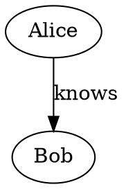
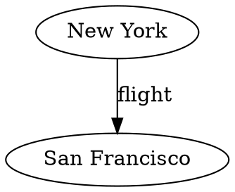

# graph2dot

## Problem Statement

Given a graph represented as a JSON object containing `nodes` and `edges`
arrays (the format returned by `/api/graph`), produce a valid Graphviz DOT
`digraph` that preserves the topology and labels of the original graph.

DOT is a **lossy** export format: only node IDs, node labels, and edge
labels are preserved. All visual styling properties (colours, shapes,
border widths, font sizes, etc.) carried as extras on nodes and edges are
silently dropped.

All identifiers are emitted as double-quoted strings to safely handle
spaces, punctuation, and other special characters in node names.

## Input Format

A JSON object with two arrays:

```json
{
  "nodes": [
    {"id": "Alice", "label": "Alice"},
    {"id": "Bob", "label": "Bob"}
  ],
  "edges": [
    {"id": "e1", "from": "Alice", "to": "Bob", "label": "knows"}
  ]
}
```

Nodes have at least `id` (and usually `label`). Edges have `from`, `to`,
and optionally `label`. Both may carry arbitrary extra properties that are
ignored during conversion.

## Output Format

A Graphviz DOT `digraph`:



* Node declarations: `"<id>" [label="<label>"];`
* Edge declarations: `"<from>" -> "<to>" [label="<label>"];`
* Edge label attribute is omitted when the label is empty
* All identifiers are double-quoted with proper escaping of `"` and `\`

## Examples

### Empty graph

Input: `{"nodes": [], "edges": []}`

Output:

```dot
digraph G {
}
```

### Nodes with spaces

Input: nodes `"New York"` and `"San Francisco"` connected by `"flight"`

Output:


